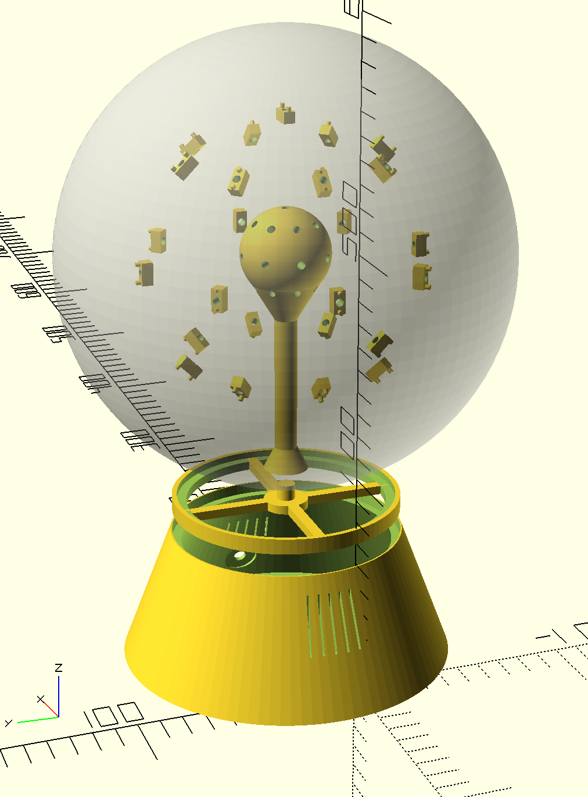

# sentimental

## 3D Printing



|Part|Count|
|---|---|
|[sentimental_base.stl](cad/sentimental_base.stl)|x1|
|[sentimental_case.stl](cad/sentimental_case.stl)|x1|
|[sentimental_nucleus.stl](cad/sentimental_nucleus.stl)|x1|
|[sentimental_mounts.stl](cad/sentimental_mounts.stl)|x25|

Printing notes:
* Printed on my Ultimaker 2 printer using white Polymaker Polymax PLA.
* No supports are required.
* The case has a very large surface area touching the build plate.  Take appropriate measures (glue stick, painters tape, etc.)so that you can get it off.
* Before printing, you may want to check measurements for the barrel jack port, armature wire holes and LED mounts.  If you're careful, you can get everything to friction fit, but it depends on the tolerance of your printer.  

## Assembly

## Installing the Software
1.  Update the Pi
    ````bash
    sudo apt-get update
    sudo apt-get upgrade
    ````

1.  Install Required Packages
    ````bash
    sudo apt-get install sox libsox-fmt-all
    sudo apt-get install libmagic-dev libatlas-base-dev
    ````

1.  Install NVM
    ````bash
    wget -qO- https://raw.githubusercontent.com/creationix/nvm/v0.33.4/install.sh | bash
    export NVM_DIR="$HOME/.nvm"
    [ -s "$NVM_DIR/nvm.sh" ] && \. "$NVM_DIR/nvm.sh"  # This loads nvm
    [ -s "$NVM_DIR/bash_completion" ] && \. "$NVM_DIR/bash_completion"  # This loads nvm bash_completion
    ````

1.  Install Node
    ````bash
    nvm install node
    ````

1.  Configure Sound

    1.  Figure out your sound card's ID:
        ````bash
        arecord -l
        ````

    1.  Note the card number and create an asound.rc file in the user home path:

        ````bash
        vi ~/asound.rc
        ````

        With the content:
        
        ````
        pcm.!default {
            type hw
            card 1
        }
        
        ctl.!defult {
            type hw
            card 1
        }
        ````

1.  Install the Sentimental Project
    ````bash
    git clone git@github.com:rejamison/sentimental.git
    cd sentimental
    npm install
    ````

1.  Run the Project
    ````bash
    node index.js
    ````
    
## Bill of Materials

|Tools|
|---|
|Soldering Iron and Solder|
|Wire Strippers|
|Lots of Small Wire Segments|
|CA Glue|

|Item|Count|Unit Price|Total|Link|Notes|
|---|---|---|---|---|---|
|Raspberry Pi 3|1|$35|$35|[Amazon](https://www.amazon.com/Raspberry-Model-1-2GHz-64-bit-quad-core/dp/B01CD5VC92/ref=sr_1_4?s=pc&ie=UTF8&qid=1506478376&sr=1-4&keywords=raspberry+pi+2)|We actually used a Pi 2, but using a 3 will save having to get a separate wifi adapter.|
|FadeCandy|1|$24|$24|[Amazon](https://www.amazon.com/Adafruit-FadeCandy-Dithering-USB-Controlled-NeoPixels/dp/B00JHJJF9W/ref=sr_1_1?s=electronics&ie=UTF8&qid=1506478498&sr=1-1&keywords=fadecandy)||
|6-Inch Micro USB Cable|1|$3|$3|[Amazon](https://www.amazon.com/StarTech-com-USB2HABM6IN-6-Inch-Mini-Cable/dp/B003WV5DME/ref=sr_1_13?s=electronics&ie=UTF8&qid=1506478537&sr=1-13&keywords=mini+usb+cable+3+inch)||
|RGB LEDs|25|$2|$50|[Adafruit](https://www.adafruit.com/product/1312)|We used these because we had them on-hand, but you might try something like these which are $0.18 / LED: [Amazon](https://www.amazon.com/kuman-WS2812B-Addressable-Arduino-littlergb/dp/B01M5BEO1C/ref=sr_1_9?ie=UTF8&qid=1506478929&sr=8-9&keywords=rgb+led+pcb+ws2812b)|
|5V 2.5A Power Supply|1|$9|$9|[Amazon](https://www.amazon.com/Super-Power-Supply%C2%AE-Certified-5-5x2-5mm/dp/B00DHRSMBW/ref=sr_1_20?s=electronics&ie=UTF8&qid=1506479459&sr=1-20&keywords=2.5a+5.5mm)||
|5.5mm Panel Mount Barrel Jack|1|$2|$2|[Amazon](https://www.amazon.com/CESS-4-Pack-Socket-Female-Connector/dp/B01GBT9N0G/ref=pd_sbs_23_2?_encoding=UTF8&pd_rd_i=B01GBT9N0G&pd_rd_r=15TR9JVFMFPMCEHXHHH6&pd_rd_w=B8GTL&pd_rd_wg=rihfR&psc=1&refRID=15TR9JVFMFPMCEHXHHH6)||
|10-Gauge Armature Wire|1|$10|$10|[Amazon](https://www.amazon.com/Jack-Richeson-400340-10-Gauge-Armature/dp/B00251E57G/ref=sr_1_4?ie=UTF8&qid=1506479518&sr=8-4&keywords=armature+wire)||
|USB Microphone|1|$15|$15|[Amazon](https://www.amazon.com/Kinobo-Microphone-Desktops-Dictation-Software/dp/B00NSOWWIS/ref=pd_sim_147_2?_encoding=UTF8&pd_rd_i=B00NSOWWIS&pd_rd_r=MD9SG6M7PMETYHW0QE32&pd_rd_w=crwiO&pd_rd_wg=x7LeI&psc=1&refRID=MD9SG6M7PMETYHW0QE32)|We used a USB microphone after having a lot of trouble with sound quality using the onboard audio.  YMMV.|
|8" Frosted White Globe|1|$9|$9|[Amazon](https://www.amazon.com/WESTINGHOUSE-LIGHTING-CORP-85571-Globe/dp/B000LNO62O/ref=sr_1_5?ie=UTF8&qid=1506480338&sr=8-5&keywords=lamp+globe)||
|Total| | |$157|||

## Build Notes

* Ought to include a speaker and maybe an external audio jack.  You can turn this into an Alexa, Mycroft, Google or other digital assistant, and more.
