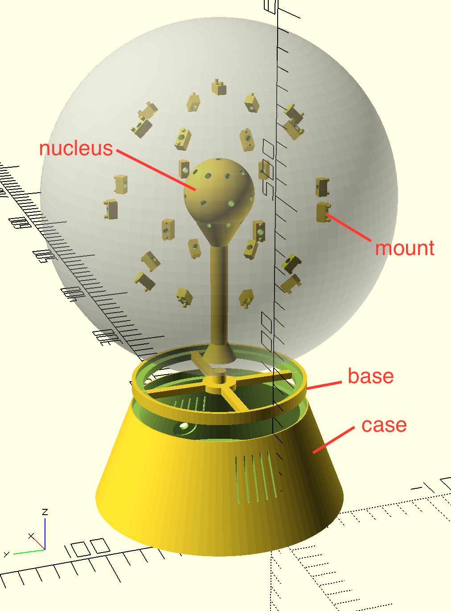

# sentimental

This is an LED globe with mic and speaker output built by Caleb and Robert Jamison.


## 3D Printing

|Part|Count|Material|Print Time|
|---|---|---|---|
|[sentimental_mounts.stl](cad/sentimental_mounts.stl)|x25|10g|2 hours|
|[sentimental_nucleus.stl](cad/sentimental_nucleus.stl)|x1|30g|6 hours|
|[sentimental_base.stl](cad/sentimental_base.stl)|x1|20g|2 hours|
|[sentimental_case.stl](cad/sentimental_case.stl)|x1|100g|15 hours|
|**Total**| |**160g**|**25 hours**|



Printing notes:
* Printed on my Ultimaker 2 printer using white Polymaker Polymax PLA.
* No supports are required.
* Printed with 50% infill and brim to avoid warping.
* The case has a very large surface area touching the build plate.  Take appropriate measures (glue stick, painters tape, etc.)so that you can get it off.  You might also want to use a brim to avoid warping depending on your material.
* The case is optional if you have another Pi case and don't mind the wires.
* If you're careful, you can get everything to friction fit, but it depends on the tolerance of your printer and the specific parts you're using.  Before printing, you should check measurements for:
    * barrel jack port (6mm)
    * armature wire holes (3.5mm w/ 0.1mm tolerance)
    * LED mounting holes (2mm holes, 8mm apart)
    * globe bottom diameter (98.5mm)
* If anything measures out differently, then use OpenSCAD to adjust the models.

## Assembly

If you're printing as you assemble, start with the mounts.

1. Create a continuous strand with the RGB LEDs, soldering 3" of wire between each of the LEDs.  Solder a long 12" at the end to connect to power and the fade candy.
1. Attach a mount to each RGB LED and attach it to the nucleus with a ~2" (depending on the size of your globe) piece of armature wire.  
   * You want the LED to sit about 1/2" from the edge of the globe, to give room for the colors to blend without blurring completely into each other.
1. Attach the armatures with LEDs to the nucleus part.  As you wind the LEDs around the nucleus, put the first LED in the top.  Then wind down, being sure to start each row in the same column.
    * We ended up gluing the LEDs to the mounts and the mounts to the armature with a bit of CA glue.  
    * _Do not_ glue the stems into the nucleus.  Consider re-printing the nucleus to get a tighter fit if needed.  The entire assembly will be too small for the opening of the globe and later you'll be assembling inside the globe.  

At this point, we recommend doing a dry run of all the electronics.


1. Wiring.  We used breadboard wire throughout to make things easy to connect/disconnect and scavenge in the future.  You'll be connecting a lot of stuff to power and ground, so:
   1.  Wire the ground side of the 5.5mm surface mount panel jack to 4 female cable ends:
       1. Pi.
       1. FadeCandy.
       1. LED strand.
       1. Electret mic - GND
       1. USB Audio in.
   1.  Wire the +5V side of the barrel jack to 4 female cable ends:
       1. Pi
       1. LED strand.
       1. Electret mic - Vdd.
       1. Electret mic - Gain.
1. LED strand:
   * Connect the data wire to the Fadecandy.
   * Connect the ground wire to the barrel jack.
   * Connect the +5V wire to the barrel jack.
1. Pi:
   * Connect pin 4 (+5V) to the barrel jack.
   * Connect pin 6 (GND) to the barrel jack.
1. Connect the Fadecandy to the Pi with USB.
1. Plug the USB Sound Card into the Pi.
1. Electret mic:
   * Connect `GND` to the barrel jack.
   * Conenct `Vdd` and `Gain` to +5V on the barrel jack.
   * Make a 3.5mm audio jack patch cable:
     * Splice the Left and Right connectors of the 3.5mm male adaptor (our mic is mono...).  Connect this to the positive end of a 1-100uF capacitor (to protect the sound card from any voltage bias) and the negative end of the capacitor to `Out` on the electret mic.
     * Splice a wire to the ground of the male adaptor which we can connect directly to the common going to the barrel jack.
   * Connect the patch cable to the mic port of the USB Sound Card.
1. Create a patch cable to the exterior audio jack by connecting the Left, Right and Ground of a male 3.5mm audio jack to the female panel mount audio jack.  Plug the male end into the USB Sound Card.
1. Setup software (below) and test using a pair of headphones.
1. Once you're confident everything is working, start putting the parts together in the case wiring them in as you go, from bottom to top:
   1. Put in the barrel jack surface mount.
   1. Put in the audio jack surface mount.
   1. Put in the Pi, screwing it in with 2.5mm screws.
   1. Put in the Fadecandy, snapping it into the mount.
   1. Connect the Fadecandy (with the left-angle extension cable if needed).
   1. Connect the USB mic (with the left-angle extension cable if needed).
   1. Put the Electret mic into the slot at the top of the case above the Pi.  The slot is intentionaly tight so that it friction fits, but you might still need a dab of non-conductive CA glue.

## Installing the Software

1.  Update the Pi
    ````bash
    sudo apt-get update
    sudo apt-get upgrade
    ````

1.  Install Required Packages
    ````bash
    sudo apt-get install sox libsox-fmt-all
    sudo apt-get install libmagic-dev libatlas-base-dev
    ````

1.  Install NVM
    ````bash
    wget -qO- https://raw.githubusercontent.com/creationix/nvm/v0.33.4/install.sh | bash
    export NVM_DIR="$HOME/.nvm"
    [ -s "$NVM_DIR/nvm.sh" ] && \. "$NVM_DIR/nvm.sh"  # This loads nvm
    [ -s "$NVM_DIR/bash_completion" ] && \. "$NVM_DIR/bash_completion"  # This loads nvm bash_completion
    ````

1.  Install Node
    ````bash
    nvm install node
    ````

1.  Configure Sound

    1.  Figure out your sound card's ID:
        ````bash
        arecord -l
        ````

    1.  Note the card number and create an asound.rc file in the user home path:

        ````bash
        vi ~/asound.rc
        ````

        With the content below, replacing `card 1` with the correct ID for your USB sound card.:
        
        ````
        pcm.!default {
            type hw
            card 1
        }
        
        ctl.!defult {
            type hw
            card 1
        }
        ````
        
    1.  Hook up your mic and some speakers or a headphone.  Test out the mic using:
    
        ````bash
        arecord -d 10 /tmp/out.wav
        ````
        
        It should start recording and you'll need to press control-c to stop.  Listen to the file you created:
        
        ````bash
        aplay /tmp/out.wav
        ````
        
        If you run into any issues, it's most likely that your USB sound card isn't set properly as the default.

1.  Install the Sentimental project:

    ````bash
    cd /home/pi
    git clone git@github.com:rejamison/sentimental.git
    cd sentimental
    npm install
    ````
    
1. Configure FadeCandy server to run on startup:

    ````bash
    cd /home/pi
    git clone https://github.com/scanlime/fadecandy
    ````
    
    Add the following to `/etc/rc.local`, which will start the server using the config inside the sentimental project:
    
    ````bash
    /home/pi/fadecandy/bin/fcserver-rpi /home/pi/sentimental/fcserver.conf > /var/log/fcserver.log 2>&1 &
    ````

    Reboot the Pi:
    
    ````bash
    sudo reboot
    ````
    
    Once it's back, check that `fcserver` is running by visiting `http://sentimental.local:7890/` from another machine on your network.  You should see a webpage showing your configuration and gives you a few options to show test patterns.
    
1.  Install AWS CLI and configure account keys.

    TBD

1.  Deploy the Lex Bot.

    TBD

1.  Run the Project

    ````bash
    cd /home/pi/sentimental
    node index.js
    ````
    
    The LEDs should light up, and you should be able to use voice commands like:
    
        "Snowboy, switch to Rotating Rainbow."

## Bill of Materials

|Basic Tools & Materials|
|---|
|Soldering Iron and Solder|
|Wire Strippers|
|Lots of Wire|
|CA Glue|
|Heat-Shrink Wire Wrap and Heat Gun (Optional)|
|1-100uF Capacitor|
|2.5mm screws|
|Matte Clear-Coat (Optional)|

|Item|Count|Unit Price|Total|Link|Notes|
|---|---|---|---|---|---|
|Raspberry Pi 3|1|$35|$35|[Adafruit](https://www.adafruit.com/product/3055)|We actually used a Pi 2, but using a 3 will save having to get a separate wifi adapter and give a little more processing horsepower as the Pi2 is about at capacity.|
|FadeCandy|1|$25|$25|[Adafruit](https://www.adafruit.com/product/1689)||
|Electret Mic w/ Amp|1|$7|$7|[Adafruit](https://www.adafruit.com/product/1063)||
|USB Sound Card|1|$7|$7|[Amazon](https://www.amazon.com/Sabrent-External-Adapter-Windows-AU-MMSA/dp/B00IRVQ0F8/ref=sr_1_4?s=electronics&ie=UTF8&qid=1508040167&sr=1-4&keywords=usb+sound+card)|We tried one of [these](https://www.adafruit.com/product/1475) but found it had a lot of noise.
|RGB LEDs|25|$2|$50|[Adafruit](https://www.adafruit.com/product/1312)|We used these because we had them on-hand, but you might try something like these which are $0.18 / LED: [Amazon](https://www.amazon.com/kuman-WS2812B-Addressable-Arduino-littlergb/dp/B01M5BEO1C/ref=sr_1_9?ie=UTF8&qid=1506478929&sr=8-9&keywords=rgb+led+pcb+ws2812b)|
|6-Inch Micro USB Cable|1|$3|$3|[Amazon](https://www.amazon.com/StarTech-com-USB2HABM6IN-6-Inch-Mini-Cable/dp/B003WV5DME/ref=sr_1_13?s=electronics&ie=UTF8&qid=1506478537&sr=1-13&keywords=mini+usb+cable+3+inch)||
|Left-Angle Male-to-Female USB|2|$4|$8|[Amazon](https://www.amazon.com/gp/product/B06VWQN2CK/ref=oh_aui_search_detailpage?ie=UTF8&psc=1)|The large USB sound card and the chunky cable for the FadeCandy required us to get these to get everything to fit nicely into the case.|
|5V 2.5A Power Supply|1|$9|$9|[Amazon](https://www.amazon.com/Super-Power-Supply%C2%AE-Certified-5-5x2-5mm/dp/B00DHRSMBW/ref=sr_1_20?s=electronics&ie=UTF8&qid=1506479459&sr=1-20&keywords=2.5a+5.5mm)|2.5A is important, vs. the more common 2A adapters, as you need the extra amperage to run the LEDs.|
|5.5mm Panel Mount Female Barrel Jack|1|$2|$2|[Amazon](https://www.amazon.com/CESS-4-Pack-Socket-Female-Connector/dp/B01GBT9N0G/ref=pd_sbs_23_2?_encoding=UTF8&pd_rd_i=B01GBT9N0G&pd_rd_r=15TR9JVFMFPMCEHXHHH6&pd_rd_w=B8GTL&pd_rd_wg=rihfR&psc=1&refRID=15TR9JVFMFPMCEHXHHH6)|We had to buy a 10-pack.|
|2.5mm Panel Mount Female Audio Jack|1|$2|$2|[Amazon](https://www.amazon.com/gp/product/B01N7CJ6JN/ref=oh_aui_detailpage_o05_s00?ie=UTF8&psc=1)|We had to buy a 10-pack.|
|2.5mm Male Audio Jack|2|$1|$2|[Amazon](https://www.amazon.com/gp/product/B00MFRZ2SG/ref=oh_aui_detailpage_o01_s00?ie=UTF8&psc=1)|We had to buy a 10-pack.
|10-Gauge Armature Wire|1|$10|$10|[Amazon](https://www.amazon.com/Jack-Richeson-400340-10-Gauge-Armature/dp/B00251E57G/ref=sr_1_4?ie=UTF8&qid=1506479518&sr=8-4&keywords=armature+wire)||
|8" Frosted White Globe|1|$9|$9|[Amazon](https://www.amazon.com/WESTINGHOUSE-LIGHTING-CORP-85571-Globe/dp/B000LNO62O/ref=sr_1_5?ie=UTF8&qid=1506480338&sr=8-5&keywords=lamp+globe)||
|**Total**| | |**$169**|||

If we were to do again, we'd probably switch the LEDs for something cheaper, such cutting up a cheap addressable RGB LED strip.

## Build Notes

* You could easily turn this into an Alexa, Mycroft, Google or other digital assistant.

## Acknowledgements

Thanks to the following projects that made this one possible:
* Snowboy by KITT.AI:  https://snowboy.kitt.ai/
